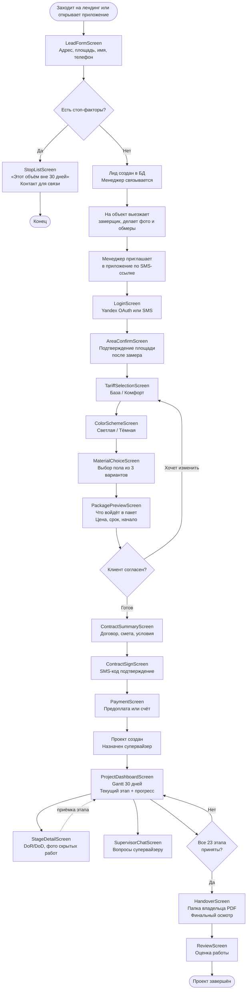

# Клиентский путь v0.2 — Flow и общая структура

> Главный документ клиентского пути. Детали по экранам — в [client-screens.md](./client-screens.md). Структура state и API — в [client-state.md](./client-state.md).

## Контекст

Клиент в v0.2 — это владелец квартиры, который выбирает один из 4 готовых пакетов (2 тарифа × 2 темы) и получает ремонт за 30 дней. Платформа — генподрядчик. **Клиент не выбирает мастеров, не общается с ними напрямую, не закупает материалы.**

## 6 этапов клиентского пути

```
1. ЛИД (без аутентификации)
   ↓
2. АВТОРИЗАЦИЯ
   ↓
3. ВЫБОР ПАКЕТА
   ↓
4. ДОГОВОР И ОПЛАТА
   ↓
5. РЕМОНТ (30 дней)
   ↓
6. СДАЧА
```

## Flow-диаграмма



## Список экранов клиента (13 экранов)

| # | Экран | Этап | Цель | Приоритет |
|---|-------|------|------|-----------|
| 1 | **LeadFormScreen** | Лид | Сбор первичных данных + проверка стоп-факторов | P0 |
| 2 | **StopListScreen** | Лид | Сообщить что объём не подходит | P0 |
| 3 | **LoginScreen** | Авторизация | Вход через Yandex OAuth (есть в v0.1) | P0 |
| 4 | **AreaConfirmScreen** | Выбор пакета | Подтверждение замеренной площади | P0 |
| 5 | **TariffSelectionScreen** | Выбор пакета | Выбор База / Комфорт | P0 |
| 6 | **ColorSchemeScreen** | Выбор пакета | Выбор Светлая / Тёмная | P0 |
| 7 | **MaterialChoiceScreen** | Выбор пакета | Выбор пола из 3 вариантов | P0 |
| 8 | **PackagePreviewScreen** | Выбор пакета | Превью что войдёт + цена | P0 |
| 9 | **ContractSummaryScreen** | Договор | Финальная смета, договор | P0 |
| 10 | **ContractSignScreen** | Договор | Подпись (SMS-код) | P0 |
| 11 | **PaymentScreen** | Оплата | Реквизиты или онлайн-оплата | P0 |
| 12 | **ProjectDashboardScreen** | Ремонт | Gantt 30 дней + текущий этап | P0 |
| 13 | **StageDetailScreen** | Ремонт | Детали этапа, фото, приёмка | P0 |
| 14 | **SupervisorChatScreen** | Ремонт | Чат с супервайзером | P0 |
| 15 | **HandoverScreen** | Сдача | Папка владельца, финал | P0 |
| 16 | **ReviewScreen** | Сдача | Оценка платформы | P1 |

> Получилось **16 экранов** (с учётом стоп-листа, оплаты и сдачи). Детально описаны в [client-screens.md](./client-screens.md).

## Что УБИРАЕМ из v0.1

| Экран v0.1 | Причина |
|---|---|
| `MastersListScreen` | Клиент не выбирает мастеров (платформа = генподрядчик) |
| `MasterProfileScreen` | Клиент не общается с мастерами напрямую |
| `OffersListScreen` | Нет офферов от мастеров (фикс. цена) |
| `ChatWithMasterScreen` | Все коммуникации через супервайзера |
| `RepairTypeScreen` (cosmetic/standard/premium/design) | Заменяется на тариф (База/Комфорт) |
| `BudgetInputScreen` (свободный бюджет) | Бюджет = цена пакета (фикс.) |
| `ScopeSelectionScreen` (выбор работ) | Скоуп жёстко задан тарифом |

## Edge Cases (общие для всех экранов)

### Аутентификация
- **Сессия истекла** во время оформления → возврат на LoginScreen, draft сохраняется в AsyncStorage
- **Yandex OAuth недоступен** → fallback на SMS-вход
- **Согласие на ПД не отмечено** → блокировать кнопку «Войти»

### Сеть и ошибки
- **Оффлайн** → показ оверлея «Нет интернета», retry-кнопка
- **5xx от Supabase** → toast «Что-то пошло не так. Попробуйте позже»
- **4xx (validation)** → inline-ошибки на полях
- **Timeout 30+ сек** → спиннер → автоматический retry 1 раз → сообщение

### Состояние пользователя
- **Уже есть активный проект** → редирект с экранов выбора пакета на Dashboard (нельзя оформить второй проект параллельно)
- **Проект отменён супервайзером** → показ экрана «Проект отменён», возможность связаться
- **Проект завершён** → доступ только к архиву и `HandoverScreen`

### Данные
- **Площадь > 100 м²** → перевод на «индивидуальный расчёт» (форма обращения, не пакет)
- **Стоп-фактор обнаружен после замера** → менеджер сообщает по телефону, в приложении статус «На переговорах»
- **Каталог обновился во время оформления** → показать diff и попросить подтвердить новую цену

### Платёж
- **Платёж не прошёл** → проект остаётся в статусе `pending_payment`, доступен экран повтора
- **Частичная предоплата** → проект может стартовать, но прогресс блокируется на середине до доплаты

## Состояния проекта (для контекста)

```
draft           — клиент оформляет, ещё не подписал договор
pending_payment — договор подписан, ждём оплату
in_progress     — оплата получена, ремонт идёт
on_hold         — приостановлен (стоп-фактор / задержка платежа / клиент попросил паузу)
completed       — все 23 этапа приняты
cancelled       — отменён до завершения
```

## Ограничения по ролям

Клиент **НЕ может:**
- Видеть других клиентов и их проекты
- Видеть мастеров (только имя текущего исполнителя этапа в карточке)
- Видеть закупочные цены материалов и поставщиков
- Связываться с мастерами напрямую (только через супервайзера)
- Менять состав пакета после подписания договора (только через запрос)
- Удалять проект самостоятельно (только через запрос отмены)

Клиент **может:**
- Создать один активный проект (нельзя 2 параллельно в MVP)
- Видеть прогресс по 23 этапам
- Принимать или отклонять этап (с обязательной причиной)
- Загружать фото и комментарии в чат супервайзера
- Скачивать «Папку владельца» при завершении
- Оставлять отзыв
- Удалить аккаунт (запускает анонимизацию через 30 дней)

## Открытые вопросы

1. **Замер** — кто едет (своя бригада или подрядная)? Бесплатно или платно? В каком статусе проект на этом этапе?
2. **Оплата** — ЮКасса/SberPay/счёт от юрлица? Онлайн или оффлайн? Полная предоплата или этапная?
3. **Договор** — оферта (одна на всех) или индивидуальный документ под каждый проект? Подпись SMS-кодом юридически валидна?
4. **Лид → Проект** — ручной перевод менеджером или автоматический после клика клиента в приложении?
5. **Замер до или после авторизации?** — клиент сначала авторизуется и потом приезжает замерщик, или сначала менеджер на телефоне согласовывает выезд?
6. **Вход в приложение** — Yandex OAuth обязателен или можно SMS? (в v0.1 только Yandex)
